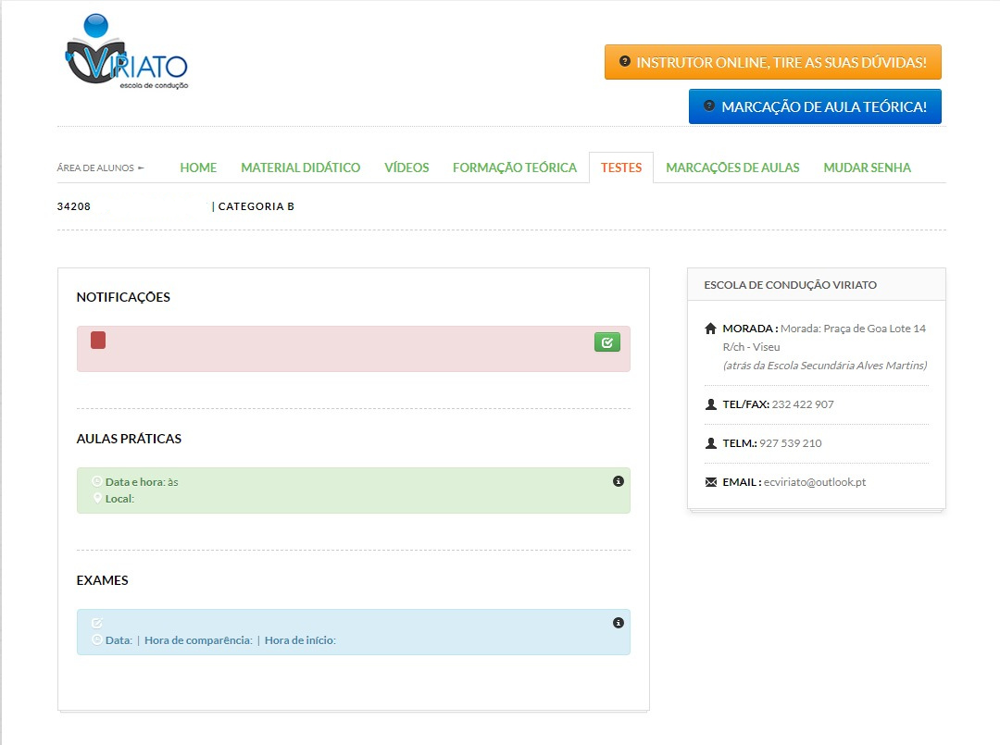
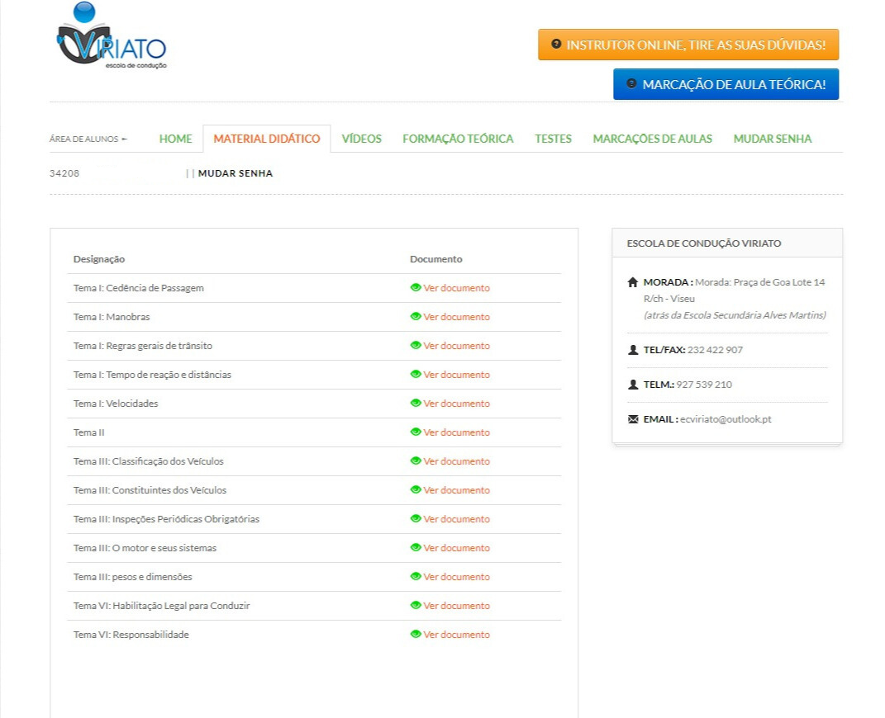
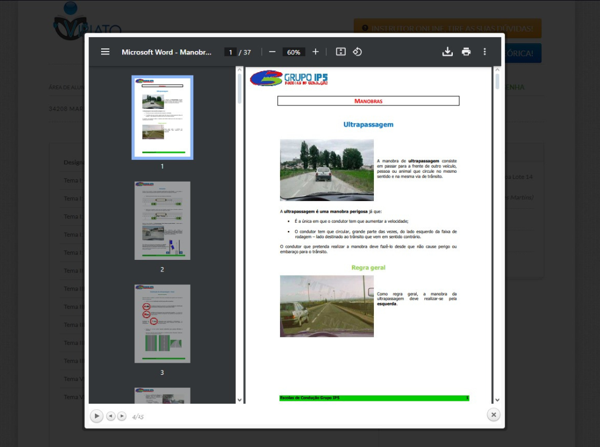
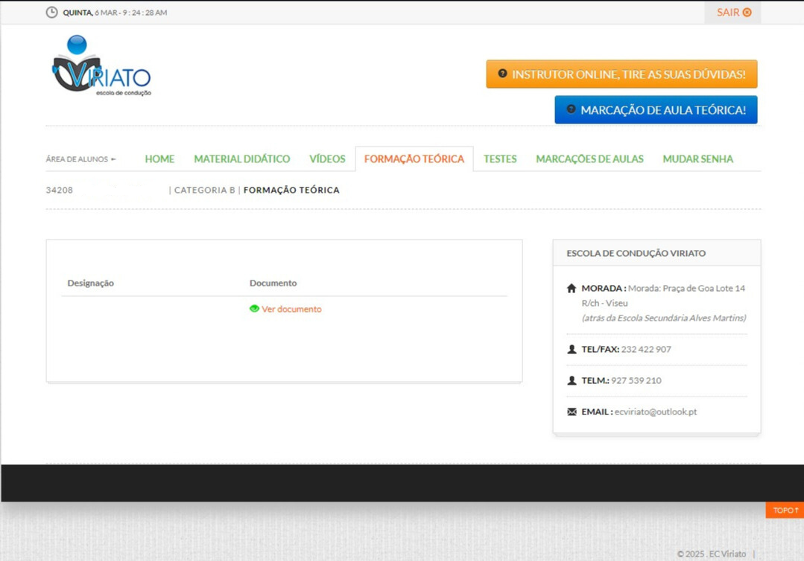
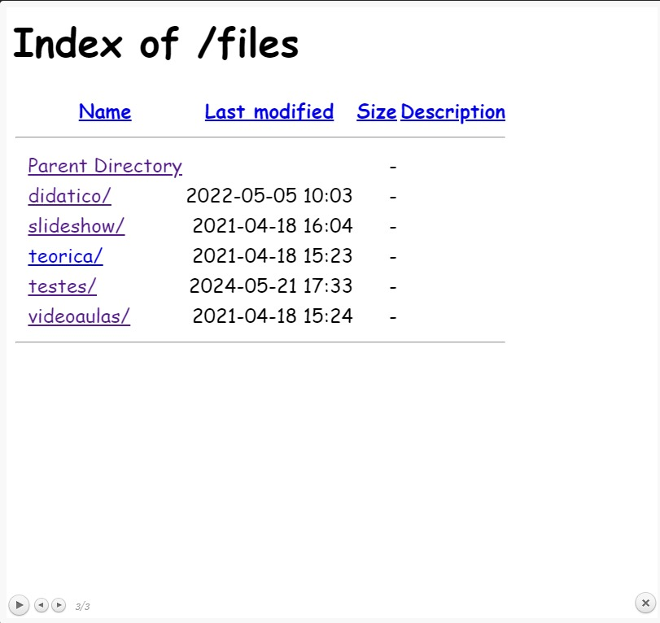
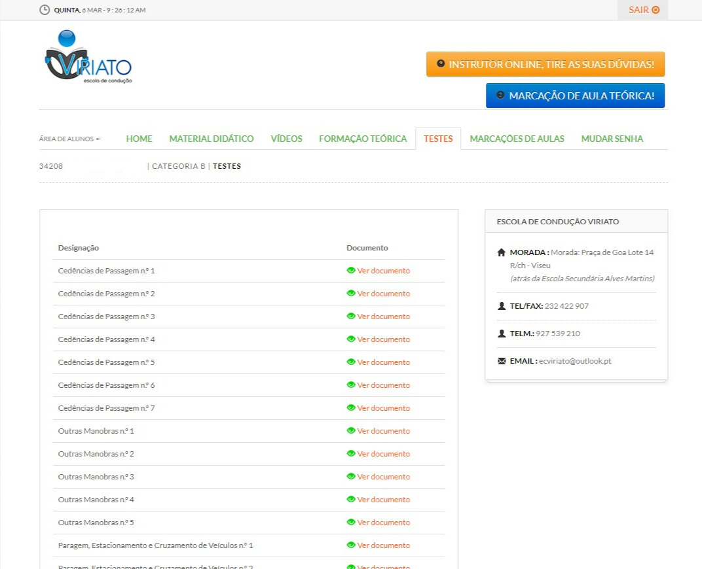
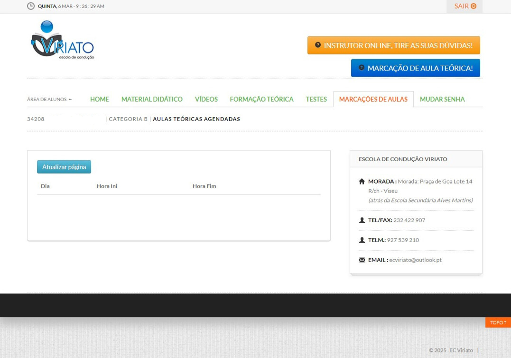
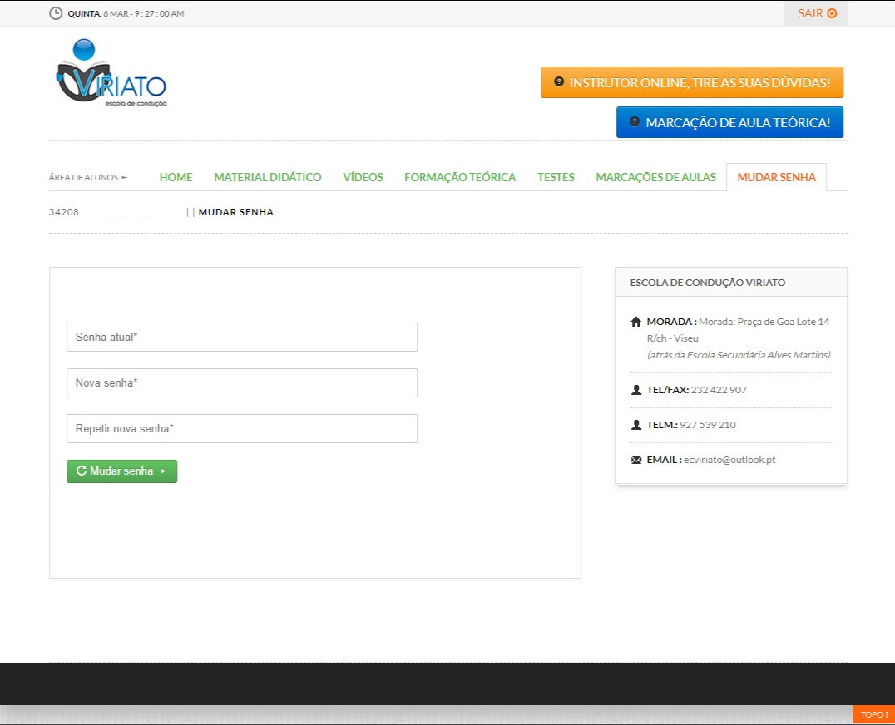
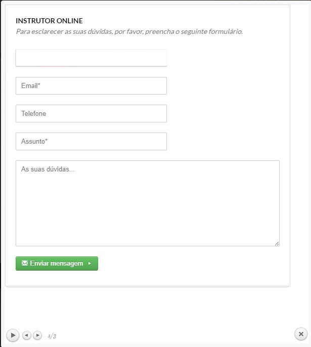

# Competitor Analysis: Viriato - Escola de Condução 
## General Information 
- **Name of System:** Viriato - Escola de Condução
- **Company/Developer:** Escola de Condução Viriato
- **Website/Product Page:** https://ecviriato.pt/
- **Version/Release Date:** ---
- **Platform(s) Supported:** Web
- **Target Audience:** Todos os envolvidas no processo de obtenção da carta de condução, nomeadamente, alunos, instrutores e a própria escola. Esta análise foca-se maioritariamente no ponto de vista do aluno.

--- 
## Core Functionality 

**Primary Purpose:** De modo a facilitar a modernização do processo de formação rodoviário, esta plataforma propõem-se a melhorar a experiência dos alunos, instrutores e funcionários de uma escola de condução.

**Key Features:** 
- ***Gestão de aulas:*** Os alunos podem marcar as suas próprias aulas.
  
- ***Disponibilização de materiais:*** Acesso a resumos teóricos sobre cada tópico lecionado, assim como vídeos.
  
- ***Realização de testes:*** Área destinada à realização de testes de diversos temas abordados durante as aulas.

**Unique Selling Points (USPs):**
- ***Modernização:*** Permite que os alunos não precisem de se deslocar à escola para marcar as suas aulas e facilita o processo burocrático entre a escola e o próprio aluno.

**Limitations/Weaknesses:**
- ***Comunicação entre aluno e escola:*** Existe uma área para os alunos tirarem as suas dúvidas com os instrutores, mas não existe uma para o aluno comunicar com a secretaria da escola de condução.
  
- ***Visualização de vídeos:*** Os vídeos não têm descrições claras sobre os temas que abordam, dificultando o processo de procura dos alunos para encontrarem o que desejam.

---

## Screenshots

  

    
    
Imagem 01 - Homepage do Website

  

  

    
    
Imagem 02 - Página do Material Didático

  

  

    
    
Imagem 03 - Apresentação de Resumos Teóricos

  

  

    
    
Imagem 04 - Página com os Vídeos das Aulas

  

  

    
    
Imagem 05 - Página da Formação Teórica

  

  

    
    
Imagem 06 - Menu que aparece quando se quer ver conteúdos da formação teórica

  

  

    
    
Imagem 07 - Página com Testes Temáticos

  

  

    
    
Imagem 08 - Página com as Aulas Marcadas

  

  

    
    
Imagem 09 - Página para Mudar a Senha

  

 

    
    
Imagem 10 - Formulário para enviar questões ao instrutor

  

## Online Reviews

