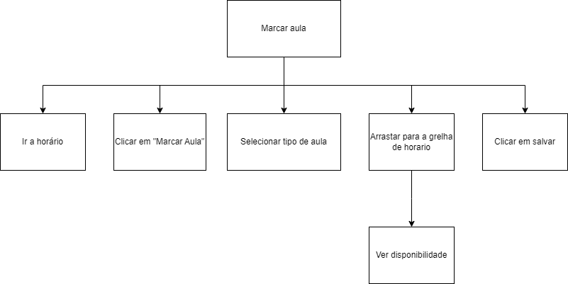
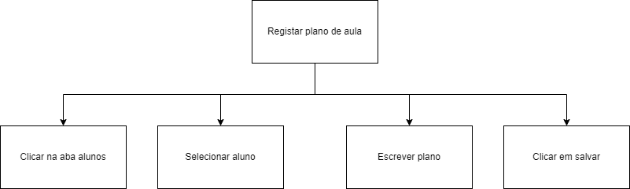

[Back to main Logbook Page](../hci_logbook.md)

---
# C. Requirement Definition
>	Based on all the gathered context, including an understanding of current practices, competitors, and user feedback and expectations: 
>	- summarize the user characteristics, context, and motivations using Personas
>	- explain your vision for a novel solution that will target user motivations using Scenarios
>	- identify requirements

# Personas

## Persona: Ricardo Fernandes
### Summary 
| Attribute        | Details                                       |
| ---------------- | --------------------------------------------- |
| **Photo**        |   |
| **Name**         | Ricardo Fernandes                               |
| **Age**          | 18                                 |
| **Occupation**   | Estudante                           |
| **Location**     | Figueira da Foz, Portugal                               |
| **Goals**        | Obtain a driving license |
| **Pain Points**  | Inconvenience of public transport; Need for good lesson planning; Concern about payments to the driving school; Anxiety during evaluation moments |
| **Motivation**   |"I want more freedom to travel without depending on bus schedules. Getting a driving license will make my life easier and give me more independence."                |
| **Full Profile** | [📄 Read More](personas/Aluno.md) |

---
## Persona: João Marques
### Summary 
| Attribute        | Details                                       |
| ---------------- | --------------------------------------------- |
| **Photo**        |             |
| **Name**         | João Marques                                |
| **Age**          | 58                                 |
| **Occupation**   | Instructor|
| **Location**     | Figueira da Foz, Portugal                               |
| **Goals**        | Continue teaching and helping students obtain their driving license|
| **Pain Points**  | Bureaucracy in the driving license process; Schedule management; Lack of communication at the school              |
| **Motivation**   | "Teaching how to drive is my passion, so I want to help my students succeed through direct and transparent contact."                |
| **Full Profile** | [📄 Read More](personas/Instrutor.md) |

---
## Persona: Gracinda Silva 
### Summary 
| Attribute        | Details                                       |
| ---------------- | --------------------------------------------- |
| **Photo**        |             |
| **Name**         | Gracinda Silva                                |
| **Age**          | 53                                 |
| **Occupation**   | Driving School Secretary                          |
| **Location**     | Figueira da Foz, Portugal                               |
| **Goals**        | Ensure organization in the administrative processes of the school |
| **Pain Points**  | Excessive paperwork; Exam scheduling with the IMT; Lack of communication at the school;|
| **Motivation**   | "I enjoy being able to assist students and easily solve all their problems." |
| **Full Profile** | [📄 Read More](personas/Secretaria.md) |

---

# Hierarchical Task analysis

## Marcar aula

## Registar plano de aula

## Atribuir um aluno a um instrutor

# Scenarios
## Scenario 1: Ricardo's Weekend
This weekend Ricardo came back from Coimbra earlier at 4 PM. He got home at around 4:30 PM and decided to **check his driving school schedule**. He realized he had 2 classes that day, a practical lesson at 7 PM and a theoretical class at 6 PM. He had **booked those classes** at the beginning of the week, however he had forgotten.

He realized he couldn't get to his first class in time so he **messaged his driving instructor and the school's secretary** telling them he couldn't make it to the class and asked if they could change his practical lesson to later that day, at 7 PM after the theoretical class.

At the end of the day, Ricardo realized he did quite well in his theoretical class so he decided to **request a theoretical exam**, however he had not fully paid what he owns to the school so he had to **pay the remaining 500€**. After that he was able to request his exam.

## Scenario 2: João's Practical Lesson
João arrived at the driving school at 8:30 AM. Before heading to the car, he decides to **check the student list** to see which students are scheduled for the morning.

He notices that one of the students, Maria, is a beginner, so he takes a few minutes to **register his lesson plan**, ensuring it covers basic maneuvers.

During the lesson, Maria struggles with clutch pedal. After the lesson, João gave Maria some feedback but also **wrote a review of Maria's progress** to track her improvement over time.

Before heading to his next lesson, João **received a message from another student**, Ricardo, who asked if they could switch his scheduled session at 5 PM for one at 7 PM. João **opened the chat feature and messaged both Ricardo and the secretary** to arrange a new schedule.

## Scenario 3: Gracinda's Day at the School
Gracinda arrived at the driving school at 9 AM. The first thing she did was **check the list of students** scheduled for practical and theoretical lessons that day to ensure everything was organized.

A new student, Bruno, walked in and said he wanted to enroll in driving lessons. Gracinda guided him through the process, collected his documents, and successfully **registered him as a studen**t in the system.

As she continued with her morning tasks, Gracing **checked the school's payments** and realized a student, Sofia, had paid all she owed to the school so she proceeded to **send Sofia a message** reminding her that she was able to request a theoretical exam already.

Later in the afternoon, João, messaged Gracinda asking if she could help reschedule Ricardo’s practical lesson. She **opened the school's schedule** and found an available slot at 7 PM, confirming the change with João and Ricardo.

---

# Requirements

## C.1. Functional requirements

### 1. Schedules
-   The system must allow show the right schedule for each student
-   Allow students to book, reschedule, and cancel theoretical and practical lessons
-   The user must not be allowed to schedule classes that are already full 

### 2. Chat
-   The system must keep the chat between the student and the instructor
-   Enable the secretary and instructors to send notifications to students

### 3. Payments
-   Display pending payments for each student
-   Allow students to complete payments through the system
-   Allow the secretary to manage and confirm student payments

### 4. Exams
-   Allow students to request a theoretical or practical exam
-   The system must send a notification once the exam is scheduled

### 5. Progress
-   Allow instructors to register and update student progress after each lesson
-   Provide students with access to their performance history and instructor feedback

### 6. Student and Instructor management
-   Allow the secretary to register new students and instructors
-   Store student information, including progress, payment status, and exam eligibility

## C.2. Non-functional requirements

### 1. Usability and accessability
-   Have a user-friendly interface that is intuitive for students, instructors, and secretaries
-   The user interface must be visually appealing
-   Be accessible on both desktop and mobile devices

### 2. Performance and reliability
-   Ensure a fast response time
-   Support multiple users accessing the system simultaneously
-   Maintain minimal downtime

### 3. Security and privacy
-   Protect user data with proper authentication
-   Ensure that only authorized users can access personal and payment information

 

---
[Back to main Logbook Page](hci_logbook.md)