[Back to main Logbook Page](../hci_logbook.md)

---
# Low Fidelity Prototype and Evaluation

## D.1. Low Fidelity Prototype

To begin developing our idea, we first created a Low Fidelity Prototype (LFP) of the app to evaluate how users would interact with it. This allowed us to gather initial feedback on both user navigation an the overall layout.

We used Figma to design the prototype, as it enabled us to focus on user experience and better visualize how our concept would function in practice.

The prototype included only the essential pages for the specific tasks we aimed to test. Once completed, we printed the design to facilitate user testing. Since our application is intended for smartphones, except the administrative section for secretaries, printing the prototype allowed for a more realistic and practical testing experience.

### Prototype Side for the Student

  

    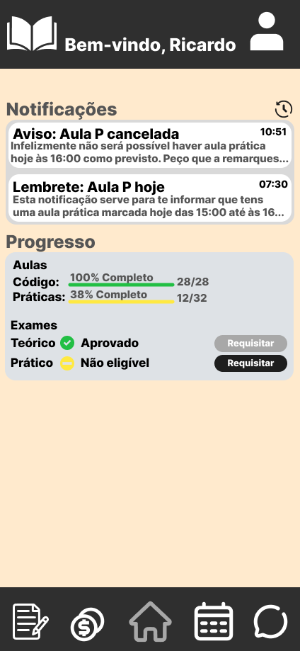
    
Image 01 - Student Homepage

  

  

    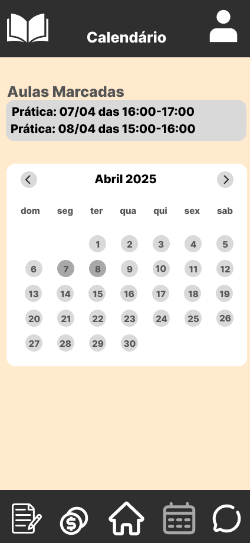
    
Image 02 - Calendar Page

  

  

    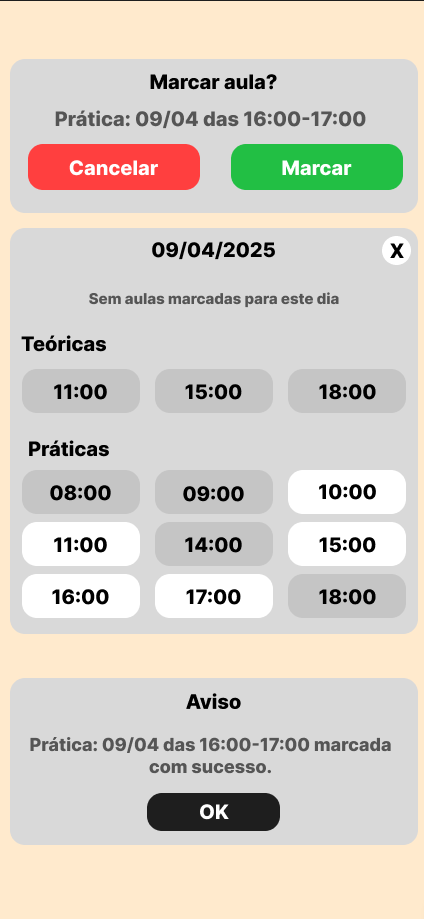
    
Image 03 - Popups used during the test

  

  

    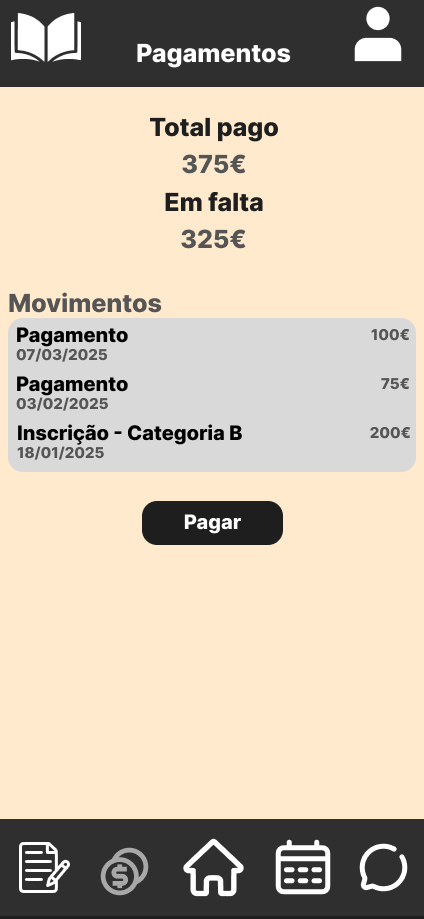
    
Image 04 - Payment Page

  

  

    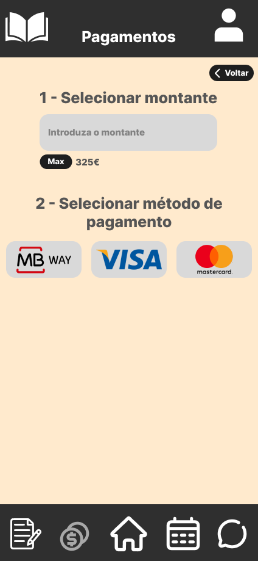
    
Image 05 - Payment Details

  

  

    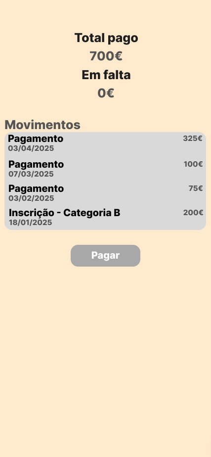
    
Image 06 - Payment Page Updated

  

---

### Prototype Side for the Instructor

  

    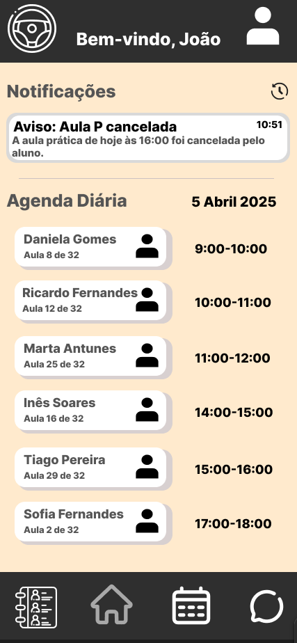
    
Image 01 - Instructor Homepage

  

  

    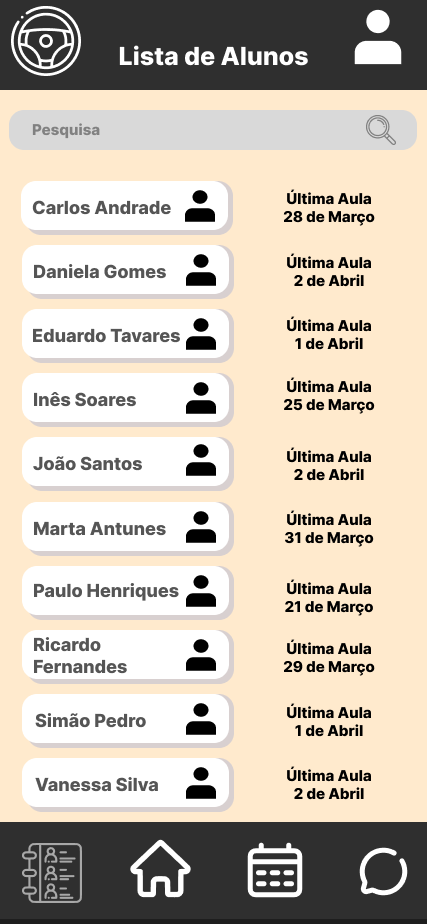
    
Image 02 - Students List Page

  

  

    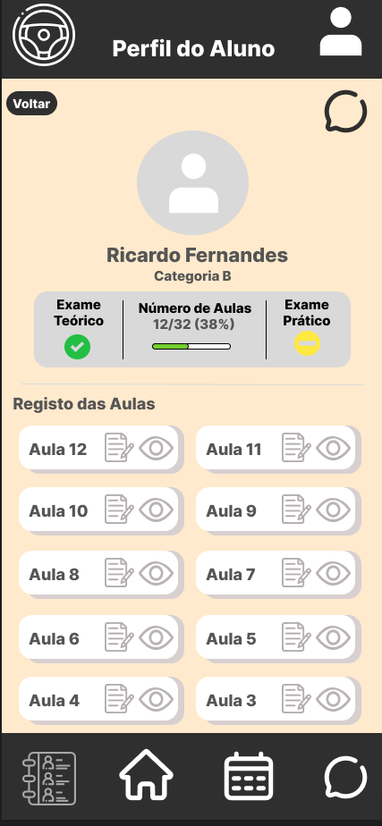
    
Image 03 - Student Profile

  

  

    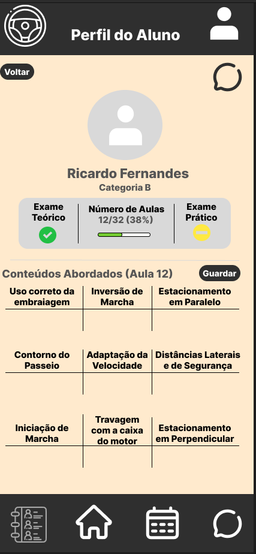
    
Image 04 - Topics of Class

  

  

    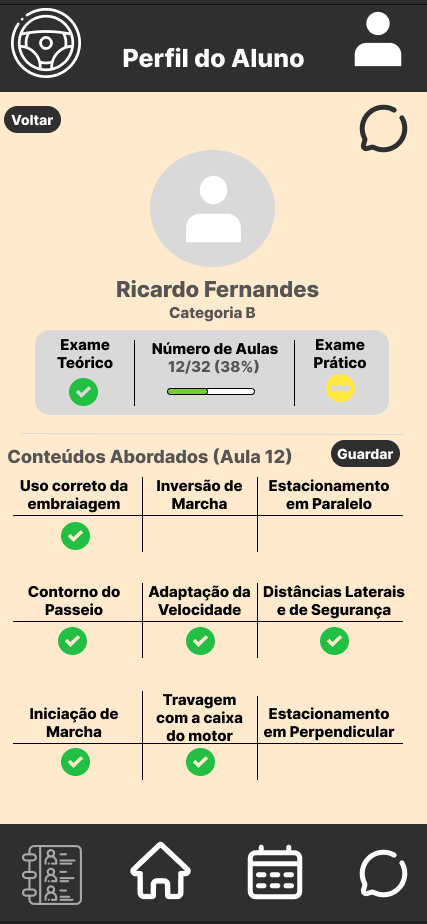
    
Image 05 - Selection of Topics

  

  

    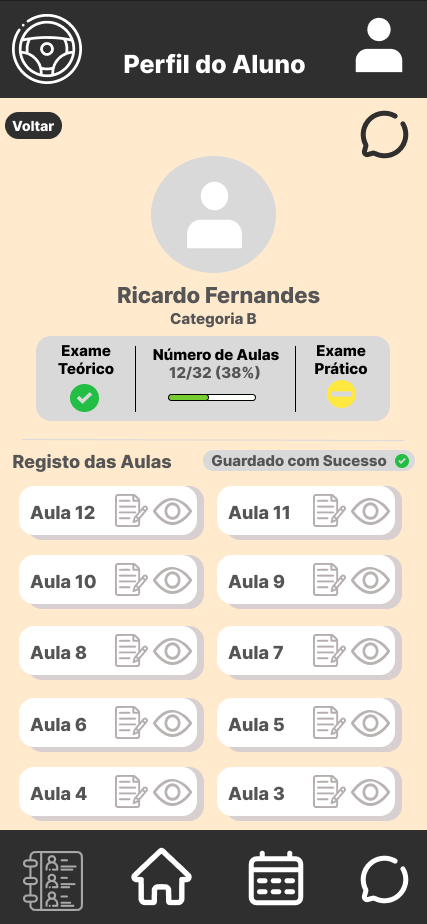
    
Image 06 - Topics Saved

  

  

    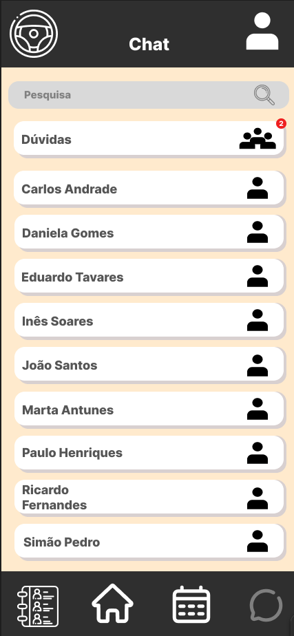
    
Image 07 - Chat Page

  

  

    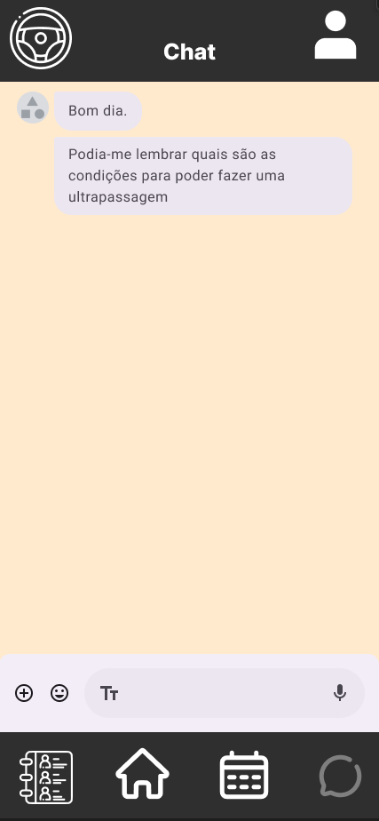
    
Image 08 - Chat

  

  

    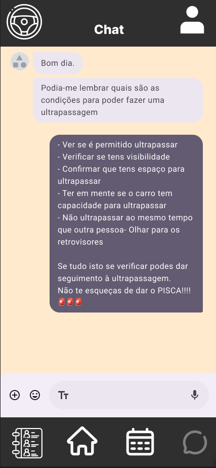
    
Image 09 - Answering a question

  

---

### Prototype Side for the Secretary

  

    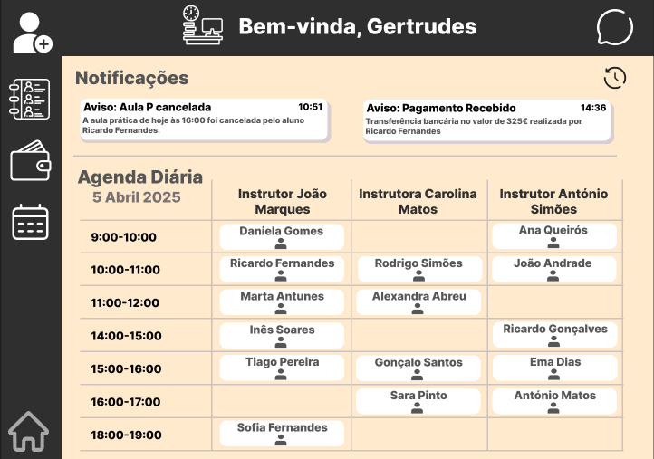
    
Image 01 - Secretary Homepage

  

  

    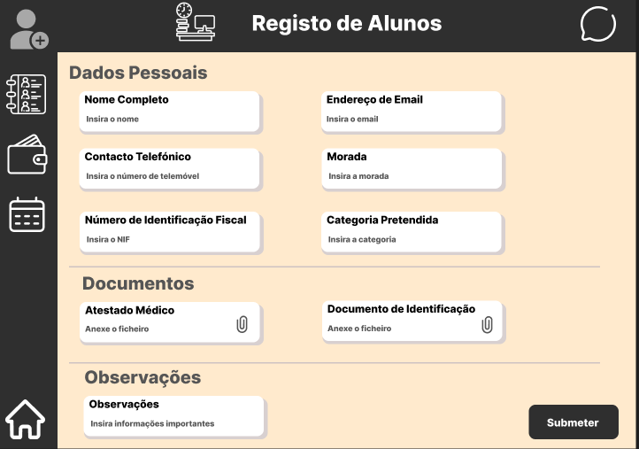
    
Image 02 - Register Area

  

  

    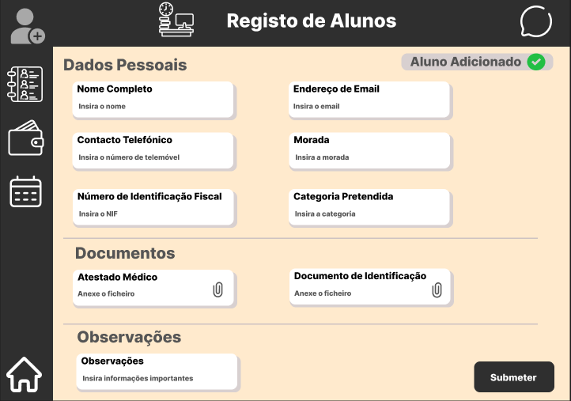
    
Image 03 - Confirmation

  

## D.2. Prototype Evaluation

### D.2.1 Student Tasks

### ***Task 1:*** Your class today (April 6th) was cancelled. Try to schedule a pratical class for April 9th at 4 p.m.

Calendar icon should be clearer, sometimes users couldn't execute the first step of the task (go to calendar's page).

Some of the users thought the notification of the class being cancelled redirects to calendar's page.

---
### ***Task 2:*** By some reason, you can't go to your class on April 7th at 4 p.m. Try to cancel that class and reschedule it to April 14th at 10 a.m.

After knowing where they should go due to task 1, it was easier to go to calendar's page.

The section where appears the schedule classes can lead to some confusion. Some of the users thought that by clicking there, they could open the schedule for that day.

In calendar's page, some users couldn't cancel the class, it should be more intuitive the need to click on the hour of the class you want to cancel.

Color of "Desmarcar" button should be changed, being green doesn't make much sense.

---
### ***Task 3:*** You want to see how much you still need to pay for your driven license. Try to pay that amount using MBWay.

Make the section to put the value the user wants to pay more visible and that amount should also appear at the payment area.

---
### D.2.2 Instructor Tasks

### ***Task 4:*** You just ended your class with Ricardo Fernandes, try to select the concepts given in class.

It should be easier to identify the last class given, some suggestions are to switch the layout of the classes or use some icon that suggests that it was the last lesson.

---
### ***Task 5:*** A student sent you a message through Questions' Chat. Try to answer him.

Some users tried to click on the notification saying that a new message was received instead of going directly to the chat icon.

On the geral chat, should appear the name of who sent the message.

---
### D.2.3 Secretary Tasks

### ***Task 6:*** Maria went to the driving school to make her registration, now you need to ask her informations and add her to the driving school platform.

The icon to the registration area should be more visible and clearer. Some users confused that icon with the one to see the list of students registered on the platform.

Some users thought that it was needed to assign a instructor to the student.

In the fields to put the student's information should exist a way to identify the mandatory fields.

---
[Back to main Logbook Page](../hci_logbook.md)

---