[Back to main Logbook Page](../hci_logbook.md)

---

# E. Functional Prototype and Evaluation

# Prototype
We used react and typescript for this project. We started by implementing the previously mentioned tasks and tried to improve the parts that were criticized.

As planned, we divided the work in 3 principal sections: student side, instructor side, secretary side.

## Selection

  

    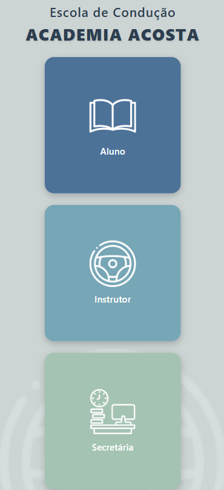
    
Image 01 - Selection 

  

## Student

### Homepage

  

    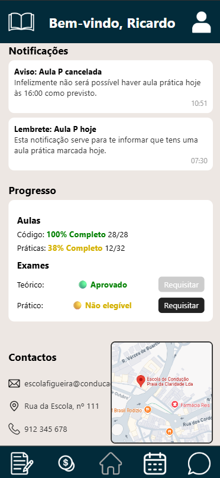
    
Image 02 - Student Homepage

  

  

### Calendar

  

    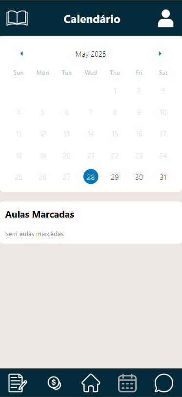
    
Image 03 - Student Calendar

  

  

    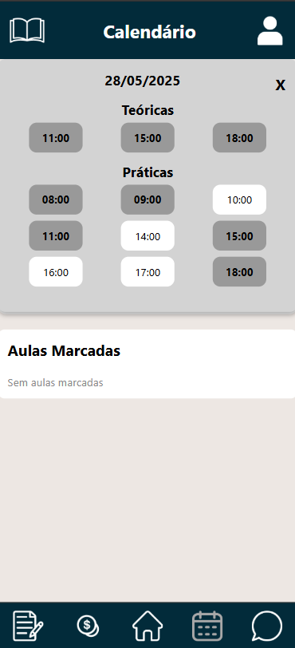
    
Image 04 - Student Calendar

  

  

    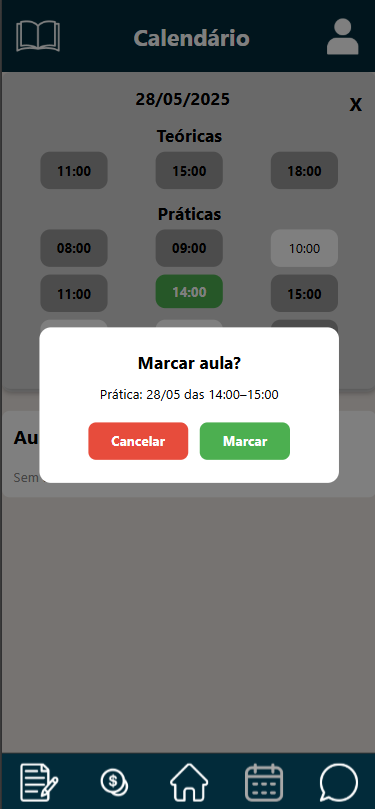
    
Image 05 - Student Calendar

  

  

    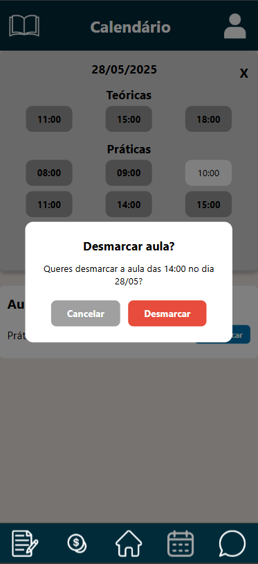
    
Image 06 - Student Calendar

  

 

### Payments

  

    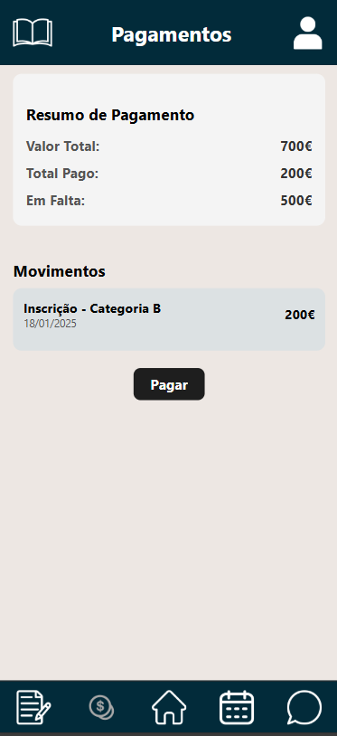
    
Image 07 - Student Payments

  

  

    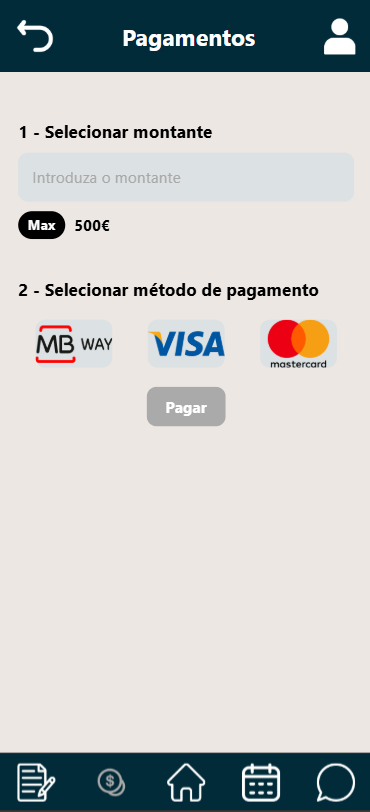
    
Image 08 - Student Payments

  

  

    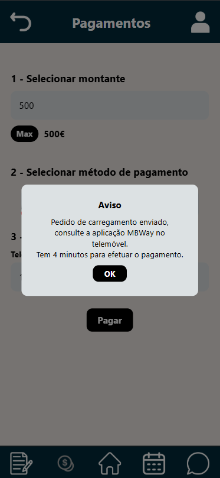
    
Image 09 - Student Payments

  

### Documents

  

    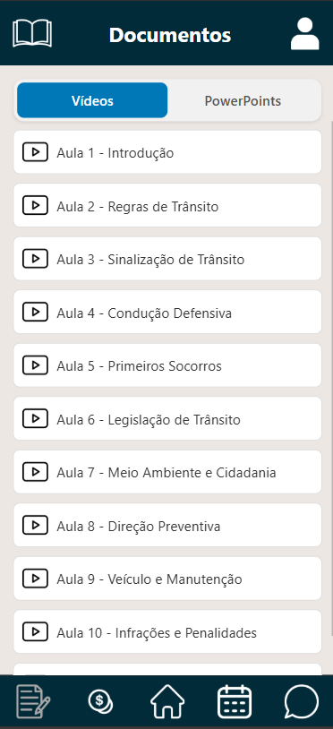
    
Image 10 - Student Documents

  

  

    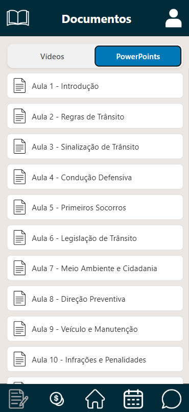
    
Image 11 - Student Documents

  

### Chat

  

    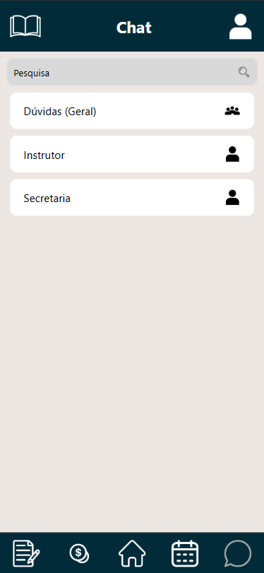
    
Image 12 - Student Chat

  

  
  

    
    
Image 13 - Student Chat

  

 
 ## Instrutor

 ### Home Page

  

    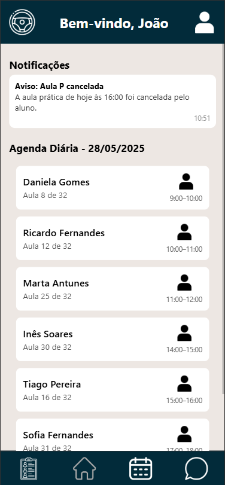
    
Image 14 - Instructor Homepage

  

### Calendar

  

    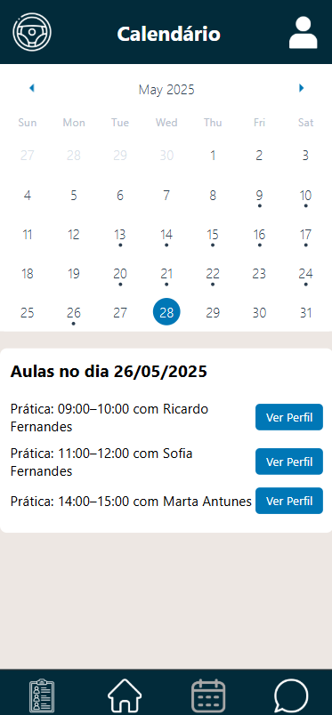
    
Image 15 - Instructor Calendar

  

### Chat

  

    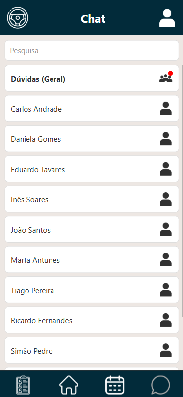
    
Image 16 - Instructor Chat

  

  

    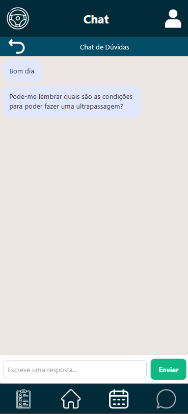
    
Image 17 - Instructor Chat

  

### Student progress

  

    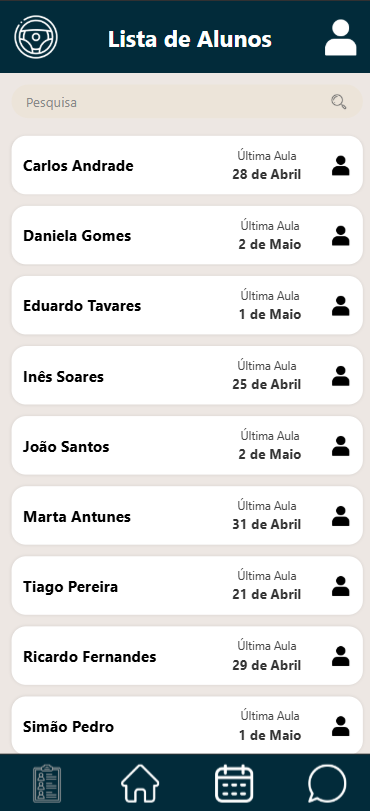
    
Image 16 - Student list

  

  

    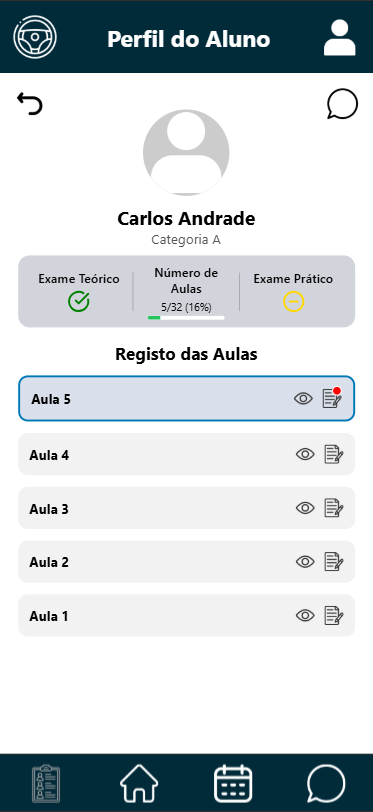
    
Image 17 - Student profile

  

  

    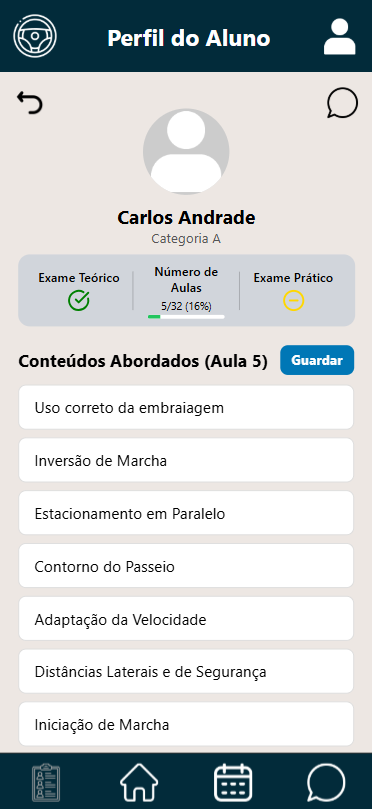
    
Image 18 - Student profile

  

  

    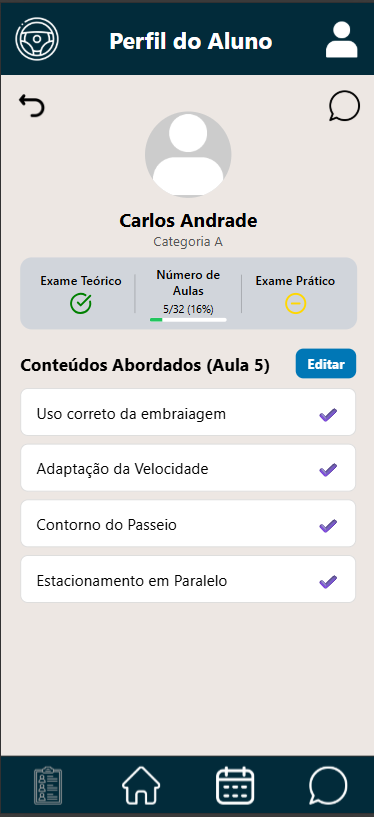
    
Image 19 - Student profile

  

## Secretary

### Home Page

  

    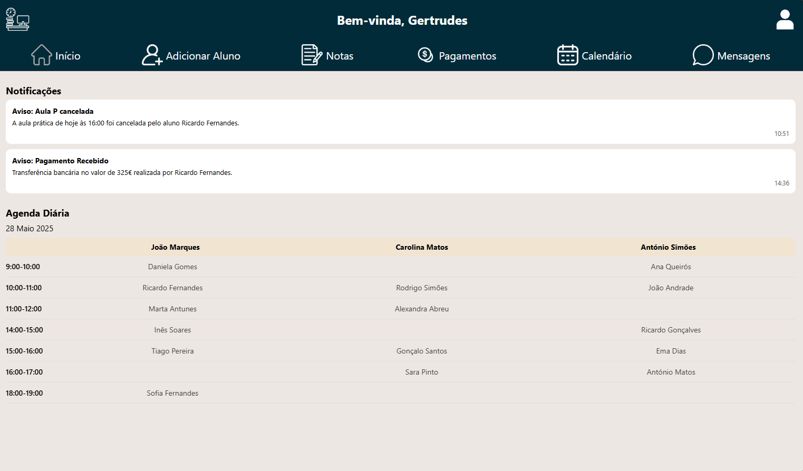
    
Image 20 - Secretary home page

  

### Add student

  

    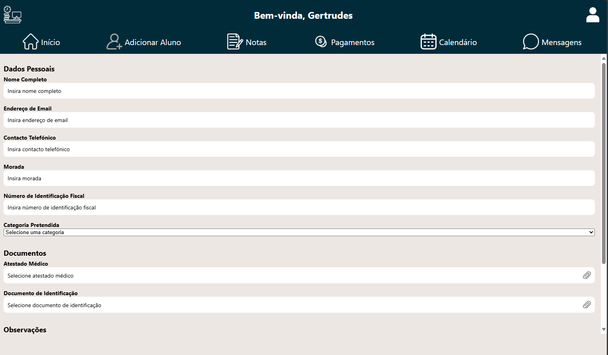
    
Image 20 - Secretary home page

  

---

## Demo Videos

To provide a clearer understanding of how our project works, we uploaded videos demonstrating the tasks performed during the user evaluation. The first video focuses the student and instructor perspectives, while the second shows the secretary’s role at the driving school.

The videos are on the folder "VideosDemo".

# E.X. User Evaluation

## SUS Evaluation Table
To evaluate our project, we used the System Usability Scale (SUS), where users rated some aspects on a scale from 1 (Totally Disagree) to 5 (Totally Agree).

|        | Question 1 | Question 2 | Question 3 | Question 4 | Question 5 | Question 6 | Question 7 | Question 8 | Question 9 | Question 10 |
|--------|------------|------------|------------|------------|------------|------------|------------|------------|------------|-------------|
| User 1 |     5      |     1      |     5      |     1      |     5      |     1      |     5      |     1      |     5      |      1      |
| User 2 |     4      |     1      |     5      |     1      |     5      |     1      |     5      |     1      |     5      |      1      |
| User 3 |     4      |     2      |     4      |     2      |     4      |     1      |     5      |     2      |     4      |      2      |
| User 4 |     5      |     1      |     5      |     1      |     5      |     1      |     5      |     1      |     5      |      1      |

***User 1:*** 100%
***User 2:*** 97.5%
***User 3:*** 80%
***User 4:*** 100%

## Tasks Evaluation Table

While users completed the assigned tasks within the application, they also rated each task using a Likert scale from 1 (Very Difficult) to 5 (Very Easy).

|        | Task 1 | Task 2 | Task 3 | Task 4 | Task 5 | Task 6 |
|--------|--------|--------|--------|--------|--------|--------|
| User 1 |    5   |   5    |   5    |    5   |    5   |    5   |
| User 2 |    4   |   5    |   5    |    5   |    5   |    4   |
| User 3 |    4   |   5    |   4    |    4   |    4   |    4   |
| User 4 |    5   |   5    |   5    |    4   |    5   |    5   |

---
[Back to main Logbook Page](../hci_logbook.md)

---